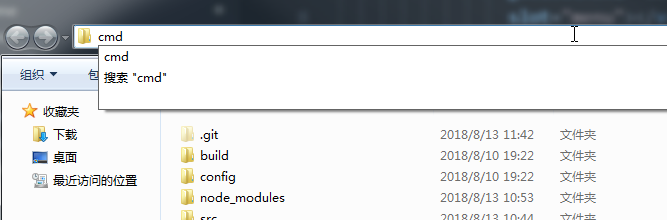

<!-- TOC -->

- [try my best for a good day](#try-my-best-for-a-good-day)
  - [Vue](#vue)
      - [vue-cli 常见问题](#vue-cli-常见问题)
      - [父子组件传参 子组件修改父组件数据](#父子组件传参-子组件修改父组件数据)
      - [新技能GET](#新技能get)
      - [轻量级web富文本框使用需注意问题](#轻量级web富文本框使用需注意问题)
      - [element table 表头合并](#element-table-表头合并)
      - [element table 表头部分修改样式](#element-table-表头部分修改样式)
      - [git上传本地项目](#git上传本地项目)
      - [拉取仓库项目](#拉取仓库项目)
      - [element-ui 使用常见问题](#element-ui-使用常见问题)
      - [字符串变量拼接两种实现方式](#字符串变量拼接两种实现方式)
      - [两个数组合并成一个](#两个数组合并成一个)
      - [其它注意事项](#其它注意事项)
      - [接口常见问题](#接口常见问题)
      - [watch属性](#watch属性)
      - [export 暴露出去](#export-暴露出去)
      - [import 引入进来](#import-引入进来)
      - [解构赋值](#解构赋值)
      - [ES6函数扩展](#es6函数扩展)
      - [箭头函数](#箭头函数)
      - [npm](#npm)
      - [时间戳](#时间戳)
      - [replace](#replace)
  - [React](#react)
      - [create-react-app 中 antd 按需加载](#create-react-app-中-antd-按需加载)
      - [propTypes与props的验证](#proptypes与props的验证)
  - [杂项](#杂项) 
      - [deg](#deg)
      - [htree windows生成目录树](#htree-windows生成目录树)
      - [空数组转换](#空数组转换)
<!-- /TOC -->

# try my best for a good day
## Vue
#### vue-cli 常见问题

1. 组件 注册：命名规则(驼峰)
  * html中：v-head
  * js中：vHead
  * html中：v-head-tap
  * js中：vHeadTap
  > 不这样写会报 <b style='color:red'>'did you register the component correctly'</b>

  引入：`import vHead from 'com/vHead' components:{vHead}`

2. 自定义路径名
  * 使用@代替src  或者 com 代替 'src/components/' 等
  * 设置地点在 build/webpack.base.conf.js下的module.exports/resolve

3. less编译
  `npm i less less-loader --save-dev` 先安装
  再去 build/webpack.base.conf.js 下的module/rules 复制追加一份
    ```js
    {
      test: /\.less$/,
      loader: "style-loader!css-loader!less-loader",
    }
    ```
4. 修改过config与build文件夹中的内容后需重新跑一次项目
---
#### 父子组件传参 子组件修改父组件数据

  a. 父组件引入子组件并注册
  > <b style='color:red'>先注册再使用</b>
    props:['num'] 记得引号
  ```
  html
    <v-heads></v-heads>
  js
    import vHeads from 'com/vHeads';
    components: {
      vHeads
    }
  ```
  b. 父组件通过 :a = a 的方式将自己的a传给子组件
  ```
  html
    <v-heads :a='a'></v-heads>
  js
    data(){
      return{
        a = 0,
      }
    }
  ```
  c. 子组件通过props属性进行接收
  ```
  props: {
    a: {
      type: Number,
      required: true
    }
  },
  ```
  d. 子组件使用该数据
  ```
  html
    <b>{{a}}</b>
  ```
  e. 子组件有修改数据的需求 调用自身方法 在方法中使用 "this.$emit('自定义方法名','要传的参数')"传给父组件 例如："this.$emit('fn',this.a)"
  ```
  需求a++
    html
      <button @click="numadd">加1</button>

    js
      methods: {
        numadd() {
          this.$emit("fn", this.a);
        }
      }
  ```
  f. 父组件 通过v-on:fn=fn2($event) 绑定自身方法fn2 在fn2 中将接收的数据进行修改
  ```
  html
    <v-heads :a='a'
              v-on:fn="fn2($event)"></v-heads>
  js
    methods: {
      fn2(a) {
        console.log(a);
        a++;
        this.a = a;
      }
    },
  ```
---
#### 新技能GET
1. 不知宽高的物体左右居中（ios独特的bug解决方案）
```
  left:50%;
  transform:translate(-50%,0)
```

2. 剩余空间自动分配

  a. 宽：
  ```css
    div{
      width:calc(100% - 100px);
      /*  100% 当前窗口宽 100px */
    }
  ```
  b. 高
  ```css
    div{
      height:calc(100% - 10vh)
      /* 100% 当前窗口高 100vh=当前窗口高  */
    }
  ```
3. ios input框禁用后出现默认样式
  3.1 解决方法：
        将disabled更换成readonly :readonly = 'flag'


---
#### 轻量级web富文本框使用需注意问题
1. z-index 尤其是和element-ui中的信息提示框（alert、confirm）等弹窗同时出现时  ```editor.customConfig.zIndex = 1```
2. 图片 上传地址不得为空 且需要后端定制 不然会出现上传失败、隐藏网络图片对话框隐藏不完全


---
#### element table 表头合并
```html
<el-table-column align='center'
                  label="入离日期">
  <template slot-scope="scope">
    <span>{{scope.row.check_in_date }} / {{scope.row.check_out_date }}</span>
  </template>
</el-table-column>
```

---
#### element table 表头部分修改样式


  使用:before 、:after 伪类元素
```css
    /* 由于scoped属性的存在，不能直接修改原有的element样式，建议使用一个class类名将其包裹，写在最终的渲染页面index.html中 */

.roomlist th:nth-child(5) .cell:after {
      content: "（ 剩余/全部 ）";
      display: inline-block;
      color: #ccc;
      font-size: 12px;
      margin-left: 4px;
      font-weight: 100;
    }
```
---
#### git上传本地项目
1.	pwd查看当前路径
2.	cd + 本地项目文件地址（将地址栏中的 \换成 / ）
3.	`git init `初始化
4.	`git add . `添加项目至暂存区
5.	`git commit -m "描述" `添加至本地版本库
6.	`git remote add origin url`[url为你github上仓库的地址]
7.	`git push origin master` 推送至远程版本库
8.  git branch -a 查看远程分支<br/>
采用下图方式可以省去1.2两步<br/>

---

```
首次提交：
git push --set-upstream origin <name> （name 远程分支名）
以后提交：
git push origin

查看本地分支：
git branch <name>（name 本地分支名）

查看远程分支：
git branch -a

切换本地分支：
git checkout <name>（name 本地分支名）

分支合并（当前在master分支，把本地的dev分支合并到当前分支）
git merge dev

创建+切换分支：
git checkout -b <name>

删除分支：（切换到其他分支然后删除）
git branch -d <name>
```
---
#### 拉取仓库项目
1. 推荐使用sourcetree，傻瓜式操作。

---
#### element-ui 使用常见问题
* 先引入 再use
``` js
import {Button,Input} from 'element-ui';
Vue.use(Button);
Vue.use(Input);
```
* 方法要使用
`Vue.prototype.$msgbox = MessageBox;`

* 属性使用 `:attribute = ''` ; 方法使用 `@change = 'fn'`
* 在单页文件中 scoped 会限制样式只对当前.vue文件有效
---
#### 字符串变量拼接两种实现方式
1. <code>&#96; ${name} &#96;</code>
2. `window['inp_'+name]`
#### 两个数组合并成一个
* 使用ES6新方法展开运算符 ```[...arr1,...arr2]//分别将arr1、arr2展开，合并到一起```
```
var arr1 = [23,43,5,6,4]
var num = 4
var temp = [...arr1,num]//[23,43,5,6,4,4]
-----
var arr = {list:{a:2,b:3}}
var temp = {...arr.list,c:4}//{a: 2, b: 3, c: 4}
-----
var arr = {list:{a:2,b:3,c: 4}}
var temp = {...arr.list,c:78}//{a: 2, b: 3, c: 78}

```
---
#### 其它注意事项
1. 常量大写
2. 学会使用less变量
3. async fn(){  try{ }catch(e){} } 获取数据的函数如果接口相同，仅参数不同，将参数写全，传入，只使用这一个函数获取数据。
4. 组件使用基础薄弱 多加练习
5. ES6多瞅瞅 尤其是async 箭头函数 解构赋值 Promise
6. 动画animation
7. vuex
8. vue-router
9. BEM 命名规范
10. init()
11. 沟通
12. learn English as soon as quickly
---
#### 接口常见问题
* 删除、取消等操作只能执行一次 前后端都要进行限制，
* 删除时如果该项目下有影响其他项目的东西禁止删除。例如：a项目下有订单产生，则不能删除a
#### watch属性
> watch 能直接获取 data和props上的数据，当数据发生变化时，该函数会执行。其后是一个对象或数组。禁止在watch中使用箭头函数
```
  watch:{
    a:function(new,old){
      console.log('新的'+new,'旧的'+old);
      console.log('a was changed')
    },
    //方法
    b:numAdd;
    //深度监听
    c:{
      handler:function(new,old){},
      deep:true
    },
    //该回调将会在侦听开始之后被立即调用
    d:{
      handler: function(new,old){},
      immediate:true
    },
    e:[
      function handle1(new,old){},
      function handle2(new,old){},
    ],
    //监听data1下的a
    'data1.a':function(new,old){}
  }
```

#### export 暴露出去

#### import 引入进来
> 引进来的数据就是个常量不许改,对象除外。<br/>
> 可以使用as重命名 eg：import {a as num} from '' 给a改名叫num 不建议这样做<br/>
> from 后面是路径，绝对、相对都行，后缀如果是js,可以不写<br/>
* 通过 `export var a = 1;export var b = 12;`暴露出来的 通过 `import {a,b} from ''` 引入
* 通过 `export default {name:'vHead'}` 暴露出来的 通过`import vHead from ''` 引入

#### 解构赋值
* `let [a,b,c] = [1,2,3]`   结果：`a = 1, b=2,c=3`
* 填坑

#### ES6函数扩展
1. 函数参数默认值(函数体内部不可以再申明相同名字的参数，形参名字不可相同)
  * `function fn(x,y){console.log(x,y)}; fn(2) // 2 underfined`
  * `function fn(x,y=9){console.log(x,y)};fn(2) //2 9`

#### 箭头函数
```
  var f = v => v;
  //等同于
  var f = function(v){return v;}
  //--------
  var f = () => 5;
  //等同于
  var f = function(){return 5;}
  //--------
  var sum = (a,b) => a+b;
  //等同于
  var sum = function(a,b){return a+b;}
```
1. 箭头函数与普通函数的区别
  * this指向
  * 箭头函数不能new
  * 箭头函数没有arguments，有rest

```
  //rest
  function add(...values) {
    let sum = 0;
    for (var val of values) {
      sum += val;
    }
    return sum;
  }
  add(2, 5, 3) // 10
```
#### npm
* 查看已安装全局包 `npm list -g --depth 0`
* nrm 切换npm包源 使用方式：`nrm ls`(查看所有源) `npm use cnpm`(使用淘宝源)
* nvm 切换node版本 使用方式：`nrm ls`(查看已安装的node版本) `nrm use 4.4.4`(使用node4.4.4)

#### 时间戳
* `new Date().getTime() === Date.new()`

#### replace
```js
// sellerCnt => seller_cnt
// minPriceOne=> min_price_one
function underline(str){
  return str.replace(/\B([A-Z])/g, '_$1').toLowerCase()
}
```
* str.replace(regexp/substr,replacement) 第二个参数可以是字符串，也可以是函数、函数第一个参数接收匹配的字符 返回处理后的字符 匹配到一次调用一次这个函数

## React
#### create-react-app 中 antd 按需加载
```
$ npm install -g create-react-app yarn
$ create-react-app antd-demo
$ cd antd-demo
$ yarn start
$ yarn add antd babel-plugin-import --save-dev
$ yarn eject
//给`package.json`中的`babel`添加如下代码：
"babel": {
  "presets": [
    "react-app"
  ],
  "plugins": [
    [
      "import",
      {
        "libraryName": "antd",
        "style": "css"
      }
    ]
  ]
}
```
#### propTypes与props的验证
```
//我一般在组件里这么用
import Proptypes from 'prop-types'

// 数据类型限制
TabsContent.propTypes = {
  lists: Proptypes.array.isRequired,
  actived: Proptypes.oneOf([0, 1, 2]).isRequired,
  // actived: Proptypes.number.isRequired,
}
```
```
// 我们可以像下面这样指定 prop 为JS 原始类型
// 这些属性值都是可选
optionalArray: React.PropTypes.array,
optionalBool: React.PropTypes.bool,
optionalFunc: React.PropTypes.func,
optionalNumber: React.PropTypes.number,
optionalObject: React.PropTypes.object,
optionalString: React.PropTypes.string,

// React.PropTypes中提供了所有的可渲染对象的验证
// 这些对象包括：数字、字符串、元素、数组等

// 节点判断
optionalNode: React.PropTypes.node,

// React元素判断
optionalElement: React.PropTypes.element,

// prop 可以定义为一个类的实例
// 判断为类实例使用JS的instanceOf 操作符判断
optionalMessage: React.PropTypes.instanceOf(Message),

// prop 可以像枚举一样，指定输入范围
optionalEnum: React.PropTypes.oneOf(['News', 'Photos']),

// 也可以指定为多个类型中的一个
optionalUnion: React.PropTypes.oneOfType([
  React.PropTypes.string,
  React.PropTypes.number,
  React.PropTypes.instanceOf(Message)
]),

// 指定类型的数组
optionalArrayOf: React.PropTypes.arrayOf(React.PropTypes.number),

// 指定对象属性值的类型
optionalObjectOf: React.PropTypes.objectOf(React.PropTypes.number),

// shape 指定传入对象属性名及值类型
optionalObjectWithShape: React.PropTypes.shape({
  color: React.PropTypes.string,
  fontSize: React.PropTypes.number
}),

// 所有类型都可以增加 'isRequired' 来限制prop不可为空
requiredFunc: React.PropTypes.func.isRequired,

// 可以同时使用'any'指定任何不可为空的任意类型
requiredAny: React.PropTypes.any.isRequired,

// 'element' 可以用于限定单个子组件
children: React.PropTypes.element.isRequired

// propTypes 支持使用自定义的验证器。
// 自定义验证，失败时要返回一个 Error 对象，不能直接使用`console.warn`
customProp: function(props, propName, componentName) {
  if (!/matchme/.test(props[propName])) {
    return new Error('Validation failed!');
  }
}
```
## 杂项
#### deg
 `debugger` 打断点 写在代码任意处
#### htree windows生成目录树
 `htree -i node_modules --output file.md`
#### 空数组转换
 ```
 if([]){
  console.log(1)
 }else{
  console.log(2)
 }
 //输出1
 //Boolean([]) => true
//Boolean({}) => true
-------------
 if([]===true){
  console.log(1)
 }else{
  console.log(2)
 }//输出2
 //Number([]) => 0
 //Number(true) => 1
 //吃鲸
 ```
 #### 运行本地node包
 ```
 	"wdser": "node node_modules\\fis3\\bin\\fis.js server start --root ./output",

 ```
